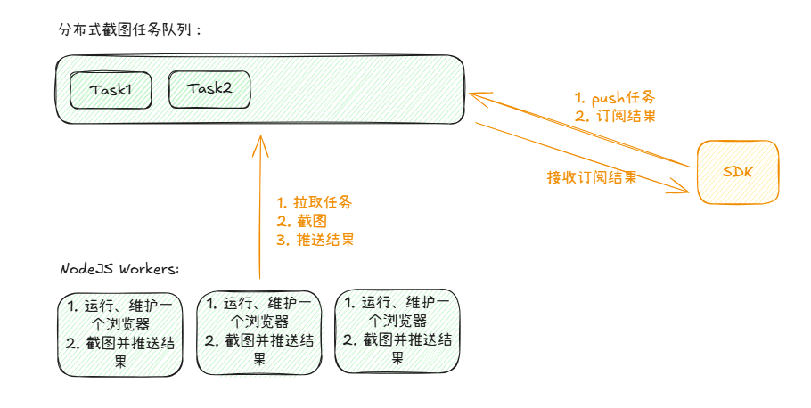

# WebPage Screenshot
一个用于解决由服务端触发的网页截图需求的开源服务。

# todo list
1. 单浏览器多页面截图
   1. 目前截图是单浏览器单页面的，服务利用率不高，若想要加快速度只能横向扩展，但实际上一个节点远远没有利用到其性能的极限
2. 任务高级控制
   1. 任务投递时支持timeout（并且必填），超过timeout的不处理，认为失败
3. 浏览器守护
   1. 主备浏览器进程，崩溃备用快速顶上
   2. 高CPU、高内存占用探测，主动结束
4. Java SDK开发
   1. 封装从任务提交到扫描任务队列直到任务完成的逻辑
   2. 多路复用批处理，将redis负载从业务调用次数级别降低到服务器级别，和日常heartbeat类似

# NOTE
- 请在项目根目录运行